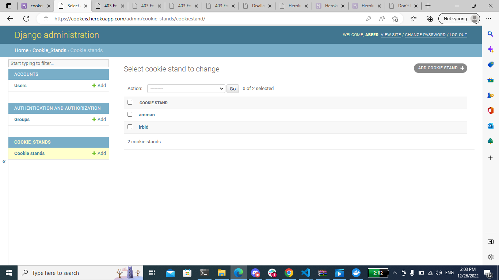

# lab 29
# heroku deploy


### Author:
* AbdallahMosa
* Abeer alshboul
* Dina alshboul

### [PR1](https://github.com/abeershboul/cookie-stand-api)
### heroku link : https://cookeis.herokuapp.com/admin
user name : abeer
password : abeer




##  create django aproject
- ```django-admin startproject project-name . ```
## run the server
- ```python manage.py runserver```
## create a Django app
-```python manage.py startapp app-name```
### To get rid of the warning message on the terminal and To reflect any changes on the database
- `python manage.py migrate`
## create a superuser will all permissions
- `python manage.py createsuperuser`


## `python manage.py makemigrations`
## ` pip freeze > requirements.txt `
## ` docker-compose up `
## `docker-compose up --build`
## `docker-compose run web python manage.py migrate`
## `docker-compose run web python manage.py createsuperuser`
